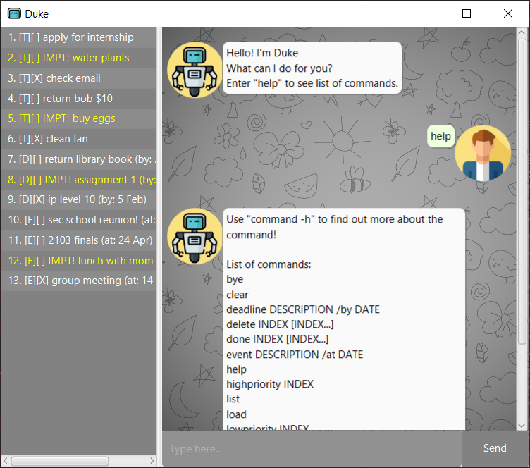

# Duke User Guide

* Table of Contents
{:toc}

--------------------------------------------------------------------------------------------------------------------

## Quick start

1. Ensure you have Java `11` or above installed in your Computer.

1. Download the latest `Duke.jar` from [here](https://github.com/garyljj/ip/releases).

1. Copy the file to the folder you want to use as the _home folder_ for your Duke.

1. Double-click the file to start the app. The GUI similar to the below should appear in a few seconds. Note how the app contains some sample data. 
   

1. Type the command in the command box and press Enter to execute it. Some examples to start off:
   * Typing `help` will list out all available commands.
   * Typing `sample` will fill Duke with some sample data.

1. Refer to the [Features](#features) below for details of each command.

--------------------------------------------------------------------------------------------------------------------

## Features

**Notes about the command format:** 

* Words in `UPPER_CASE` are the parameters to be supplied by the user. 
  e.g. in `todo DESCRIPTION`, `DESCRIPTION` is a parameter which can be used as `todo buy eggs`.

* Items in square brackets `[]` are optional. 
  e.g `done INDEX [INDEX...]` can be used as `done 1` or as `done 1 2`.

* Items with `…`​ after them can be used multiple times including zero times. 
  e.g. `[INDEX...]` can be used as ` ` (i.e. 0 times), `1`, `1 2 3` etc.

* Items in curly bracket `{}`​ are mutually exclusive. 
  e.g. `search {KEYWORD | DATE}` can only be used as either `search KEYWORD` or `search DATE`.

### Viewing help `help`

Format: `help`

Shows all available commands.

### Adding tasks `todo`, `deadline`, `event`

Format: `todo DESCRIPTION`, `deadline DESCRIPTION /by DATE`, `event DESCRIPTION /at DATE`

Adds a task to the tasklist.
Current supports 3 types of tasks.
1. `todo`
   * A todo task is simply a task with a description.
1. `deadline`
   * A deadline task has a description and a due date.
   * `DATE` must be in the valid format YYYY-MM-DD.
1. `event`
   * An event task has a description and a date.
   * `DATE` must be in the valid format YYYY-MM-DD.

Examples:
* `todo buy eggs`
* `deadline do math homework /by 2021-01-01`
* `event meeting with friends /at 2021-01-01`

### Listing all tasks `list`

Format: `list`

Shows a list of all tasks.

### Deleting tasks `delete`, `clear`

Format: `delete INDEX [INDEX...]`, `clear`

There are 2 ways to delete tasks
1. `delete`
   * Deletes the task at the given `INDEX`.
   * `INDEX` must be a valid number.
   * You can delete multiple tasks by listing out the indexes eg. `delete 1 2 3`.
2. `clear`
   * Clears all tasks.

A prompt for delete confirmation will be given after this command.

### Completing tasks `done`

Format: `done INDEX [INDEX...]`

After completing a tasks, you can mark it as done. 
Incomplete tasks are marked with `[ ]` 
Completed tasks are marked with `[X]`.

### Task priority `highpriority`, `lowpriority` 

Format: `highpriority INDEX`, `lowpriorty INDEX`

Set a task to high or low priorty
* Newly added tasks are set to low priority by default.
* High priority tasks appear as yellow in the listviewer.
* High priority tasks will have an extra label "IMPT!"
* High priority tasks will be pushed to top of tasklist upon `sort`.

### Exiting the program `bye`

Format: `bye`

Exits the program.
A prompt to save current tasklist will be given.

### Saving tasklist `save`

Format: `save`

Saves the current tasklist into `[JAR file location]/data/dukeData.txt`.

### Loading tasklist `load`

Format: `load`

Load a previously saved tasklist from `[JAR file location]/data/dukeData.txt`. 
Duke will automatically load data from this location on startup, if it is available. 
**Warning**: If this file is edited into an invalid format, Duke will start up with an empty tasklist.

### Sorting tasklist `sort`

Format: `sort`

Sorts the tasklist with the following order:
1. High priority task
1. Incomplete task
1. Todo task
1. Task with eariler date
1. Lexicographically

### Sample data `sample`

Format: `sample`

Fills Duke with sample data for new users to get a feel of the task manager. 
**Warning**: Calling `sample` will overwrite any current tasks in the tasklist.

### Searching for tasks by name or date `search`

Format: `search {KEYWORD | DATE}`

Shows a list of tasks which matches the keyword or falls on the given date.
1. Search by `KEYWORD`
   * It is case-insensitive. eg. `book` will match `Book`.
   * It can match partially. eg. `return b` will match `Return Book`.
2. Search by `DATE`
   * `DATE` must be in the valid format YYYY-MM-DD.
   * All deadline tasks due on the given `DATE` will be matched.
   * All event tasks happening on the given `DATE` will be matched.

Examples:
* `search book`
* `search 2021-01-01`

### Listviewer

Displays list of all tasks on the left of the gui.

### Keyboard shortcuts

1. `ESC` key 
Clears input.
1. `UP`, `DOWN` arrow keys 
Scroll through input history.

--------------------------------------------------------------------------------------------------------------------

## Command summary

Action | Format, Examples
-|-
**bye** | `bye`
**clear** | `clear`
**deadline** | `deadline DESCRIPTION /by DATE` eg. `deadline do math homework /by 2021-01-01`
**delete** | `delete INDEX [INDEX...]` eg. `delete 1`, `delete 1 2 3`
**done** | `help`
**event** | `event DESCRIPTION /at DATE` eg. `event meeting with friends /at 2021-01-01`
**help** | `help`
**highpriority** | `highpriority INDEX` eg. `highpriority 1`
**list** | `list`
**load** | `load`
**lowpriority** | `lowpriority INDEX` eg. `lowpriority 1`
**sample** | `sample`
**save** | `save`
**search** | `search {KEYWORD \| DATE}` eg. `search abc`, `search 2021-01-01`
**sort** | `sort`
**todo** | `todo DESCRIPTION` eg. `todo read book`
